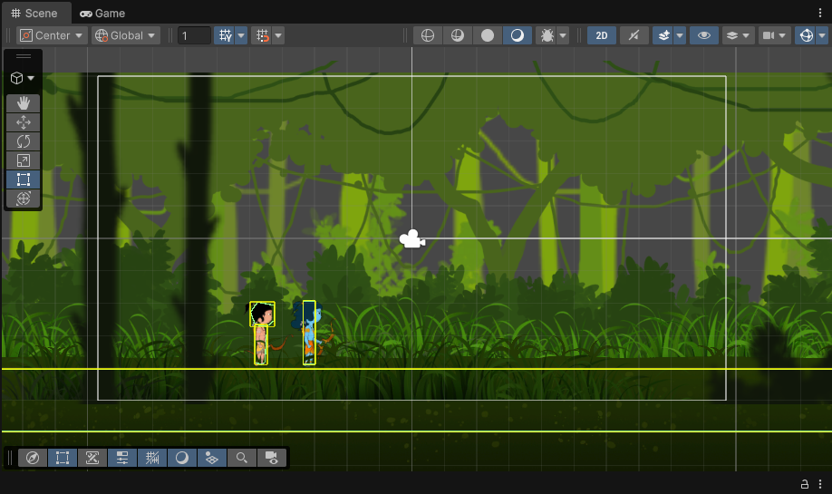
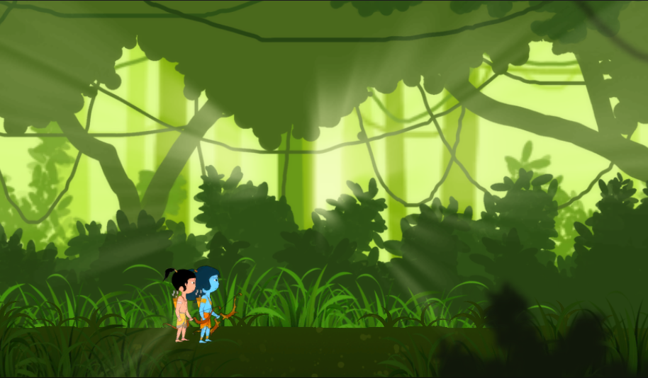

# Ramayana Lite

**Ramayana Lite** is a 2D side-scrolling action-adventure game developed in **Unity**. Inspired by the epic Ramayana, the game features archery-based combat, platforming challenges, and beautiful parallax environments.

> ⚠️ **Note**: This project is currently in an **early prototype stage**. Mechanics, visuals, and features are subject to change and improvement.

## 🎮 Features
- **Archery Combat**: Intuitive drag-and-shoot mechanics for aiming arrows.
- **Dynamic Platforming**: Jump and traverse through levels filled with obstacles.
- **Skeletal Animation**: Smooth 2D character animations powered by **DragonBones**.
- **Parallax Scrolling**: Immersive multi-layered backgrounds.
- **Mobile Optimized**: Touch controls designed for mobile devices.

## 📸 Screenshots & Gameplay

<p align="center">
	<a href="https://www.youtube.com/watch?v=kNWshgacKVI">
		
		<br/>
		<em>Click to Watch Gameplay Video</em>
	</a>
</p>

<p align="center">
	
	
</p>

## 🕹️ Controls
| Action | Input (PC) | Input (Mobile) |
| :--- | :--- | :--- |
| **Move** | `Horizontal Axis` (A/D or Arrows) | On-screen Joystick / Tilt |
| **Jump** | `Up Arrow` | Tap Jump / Swipe Up |
| **Aim & Shoot** | Click & Drag Mouse | Touch & Drag on Character |

## 🛠️ Technical Details

This project utilizes **Unity** for the game engine and **DragonBones** for 2D skeletal animation.

### Dependencies
- **Unity**: `6000.3.4f1`
- **DragonBones**: `3.9` (Included in Assets)

### Setup & Installation
1. Clone the repository:
   ```bash
   git clone https://github.com/rakeshmalik91/ramayana-mobile.git
   ```
2. Open the project in **Unity Hub** (ensure you have the compatible Unity version).
3. Load the scene `Assets/Level1.unity`.
4. Press **Play** to test in the editor.

## 📚 Related Blogs
- [2D Background Scrolling & Parallax Scrolling in Unity3D](https://ghostknife.medium.com/2d-background-scrolling-parallax-scrolling-in-unity3d-5909245ea1e3)
- [Using DragonBones in Unity](https://ghostknife.medium.com/using-dragonbones-in-unity-1c07f55adaf8)

---
*Developed by Rakesh Malik*
